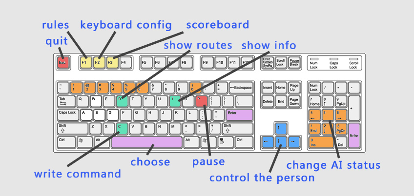

## Explore Reactor Room 使用说明文档

- - - - - - -  
### 应用程序信息
- 名称：Explore Reactor Room (aka. Flight Route Simulator)
- 作者：Shallwe
- 日期：2018/10/10
- 当前版本：v1.0.0
- 适用操作系统：Windows7以上

- - - - - - -  
### 程序操作说明

#### 游戏规则
- 该程序模拟了IARC Mission 8的真实比赛场景。你在游戏中控制一个人潜入反应堆房间，人有四架己方无人机伴随完成任务。你要完成指定的任务。你一共有10点生命值，有四架敌方无人机进攻你，每架己方无人机可以为你恢复一点生命值。中间有一个箱子可以供人躲避攻击。
- 成功条件：
    - 成功完成下列各个任务。
    - 任务一：己方无人机需要到达四个棕红色箱子后方，破解密码。
    - 任务二：得到密码后，己方无人机需要到箱子前开启箱子。
    - 任务三：全部密码箱开启，跑回起点。
- 失败条件：
    - 生命值为0。
    - 时间超过480s。
    - 飞机越界超过10s。
- 程序提供了排行榜功能，任务完成会记录到排行榜中。


#### 键盘操作

- F1：查看游戏说明  F2：查看键盘操作  F3：查看排行榜
- 敌方无人机设置（仅在练习模式生效）：
    - 0：原地悬停 1：直线飞行 2：圆周运动
    - 4：任务模式（简单） 5：任务模式（中等） 6：任务模式（困难）


#### 操控无人机命令
- 人要操控无人机需要在另一个窗口写指定命令。在游戏窗口按C键即可开始输入。格式如下。
    ```C++
    y 1     // 无人机去往y=1m的地点
    f 6 2   // 跟随领队无人机，沿x=6m的线和2m的间隔飞往目的地
    ```


#### 参数接口
- 程序提供了`data\program_settings.json`配置文件，可以在文件中设置某些相关参数。


- - - - - - -  
### 内部实现
- 编程语言：Python
- 关键模块：pygame, numpy

- - - - - - -  
### 修订记录
- v1.0.0 (2018/10/10)  
    - 正式发布。

